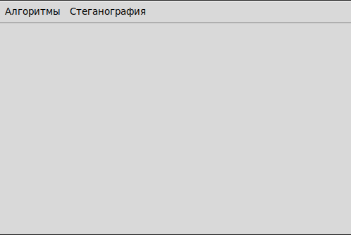

## Для корректной работы шифратора установите нужные библиотеки, при помощи команды:
```commandline
    pip install -r requirements.txt
```

## Запуск программы осуществляется при помощи:
```commandline
    python main.py
```

### При помощи моей программы Вы можете зашифровать или дешифровать како-либо секретное сообщение.
#### Варианты использования программы:

---
* Шифрование Цезаря
* Шифрование Виженера
* Шифрование Вернама
* Шифрование Азбуки Морзе
---
* Дешифрование Цезаря
* Дешифрование Виженера
* Дешифрование Вернама
* Дешифрование Азбуки Морзе
* Дешифрование методом частотного анализа

*P.S. Шифрование/дешифрование Виженера и Вернама работает с кириллицей и латиницей верхнего регистра. Перед вводом данным нажимайте кнопку удалить для корректной работы программы. В остальном желаю удачи! <3*

## Начнем работать с шифратором:
При запуске программы вы увидите данное окно:



Если вам нужно какое-то шифрование/дешифрование - нажмите на кнопку "Алгоритмы". Для стеганографии нажмите соответствующую кнопку.

При нажатии какой-либо из двух кнопок Вы увидите соответствующее меню.


Для дальнейшей работы с приложением введем соответствующие обозначения.

На картинке Вы видете максимальное количество возможных объектов с которыми Вам предстоит работать.
Номера:
1. Путь до файла, или сам текст
2. Выбрать файл при помощи "Путеводителя"
3. Удалить все с ячейки "1" и "6"
4. Выполнять шифрование/дешифрование
5. Выбор языка
6. Вспомогательные данные для шифра

*В некоторых шифрах отсуствуют элементы 5,6, потому что они просто не нужны*


После выполнения программы, Вы увидете путь до нового файла, а так же результат работы который вы можете скопировать в буфер обмена. Или если вы работали не с файлом, а с текстом, то увидете результат работы алгоритма, и сможете скопировать.